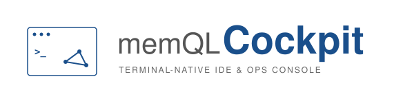

<p align="center">
  
</p>

<h1 align="center">MemQL Cockpit</h1>

<p align="center">
  <strong>The fleet worker runtime and cluster CLI for <a href="https://github.com/znasllc-io/memql">MemQL</a>.</strong><br>
  Installed as the <code>memql</code> command on the machines you enroll in your fleet.
</p>

<p align="center">
  <a href="https://github.com/znasllc-io/memql-cockpit/actions/workflows/ci.yml"></a>
  <a href="LICENSE"></a>
  
  
  <a href="https://goreportcard.com/report/github.com/znasllc-io/memql-cockpit"></a>
</p>

<p align="center"><sub><em>Designed and built with Claude as co-author.</em></sub></p>

> **Status: Alpha / pre-1.0 — not production-ready.** MemQL Cockpit is under
> active development and tracks MemQL core. The worker contract and
> configuration are still evolving; expect breaking changes between releases.

---

## What is MemQL Cockpit?

MemQL Cockpit turns a machine you own into a **worker** in your MemQL fleet:
agents on the cluster can dispatch shell / filesystem / HTTP work to it
(headless), and — on the opt-in computer-use build — drive its mouse, keyboard
and screen. Machines are managed from the MemQL Portal's Fleet section:
pairing, labels, routing policy, activity.

The installed command is **`memql`**:

- **Enroll a machine** — `memql cluster add <domain>` registers the cluster
  (identity discovery + OAuth sign-in; RFC 8628 device flow on headless / SSH
  boxes) and `memql worker pair <code>` redeems a pairing code from the portal.
- **Run as a service** — a per-user LaunchAgent on macOS
  (`com.znasllc.memql-worker`) or user-systemd unit on Linux
  (`memql-worker.service`), auto-started at login.
- **Two build variants, one command** — headless (default, CGO-free) ships
  from releases as tar.gz archives; computer-use (`-tags computeruse`, CGO +
  RobotGo) ships as prebuilt `memql-computeruse-<os>-<arch>` release assets,
  built natively per platform. `memql --version` names the variant.

It communicates with MemQL clusters over gRPC (`MemqlService.Stream` and
`WorkerService.Stream`) and does not embed the MemQL engine.

> Note: the MemQL engine repo also builds a binary named `memql`, but it ships
> only inside container images and runs in pods. This CLI is what gets
> installed on operator machines — different channels, no PATH overlap.

## Install

```bash
# one-liner (detects OS/arch, checksum-verified)
curl -fsSL https://raw.githubusercontent.com/znasllc-io/memql-cockpit/main/install.sh | sh

# pin a version, or an install dir
curl -fsSL https://raw.githubusercontent.com/znasllc-io/memql-cockpit/main/install.sh | MEMQL_COCKPIT_VERSION=v0.10.0 sh
curl -fsSL https://raw.githubusercontent.com/znasllc-io/memql-cockpit/main/install.sh | BIN_DIR=/usr/local/bin sh
```

Or, with Go (builds from source):

```bash
go install github.com/znasllc-io/memql-cockpit/cmd/memql@latest
```

Worker-machine installers (binary + service + worker.yaml in one step) live in
`scripts/install/` — the MemQL Portal's Fleet page composes the exact
one-liner for you when you add a machine. Their `--computeruse` flag installs
the prebuilt computer-use binary from the same release; building it from
source (below) remains the alternative. Their `--inference` flag runs
`memql worker setup --inference --non-interactive` once the worker is up, and
never fails the install over it — a machine that paired fine and could not set
up local models is still a working worker. Their `--version=X.Y.Z` flag pins
the release to install (`0.16.0` and `v0.16.0` both work; the default is the
latest release); `--download-base` still wins for *where* to download from
when both are given. Re-running the installer over an older install upgrades
the binary in place and refreshes the enrollment for the same cluster (the
same token and cluster is a no-op refresh); a newer installed version is
never downgraded. The closing block prints the installed version and the
cluster.

### Uninstall

One line, like the install. It stops and removes the service, removes the
binary and its symlink, and removes `~/.memql/workers.yaml` and the legacy
`worker.yaml` — the files that hold the tokens:

```bash
# Linux
curl -fsSL https://raw.githubusercontent.com/znasllc-io/memql-cockpit/main/scripts/install/uninstall-linux.sh | bash -s -- [--cluster=URL|--all-homes] [--purge] [--user-local] [--dry-run]

# macOS
curl -fsSL https://raw.githubusercontent.com/znasllc-io/memql-cockpit/main/scripts/install/uninstall-mac.sh | bash -s -- [--cluster=URL|--all-homes] [--purge] [--user-local] [--dry-run]
```

Every flag is optional; MemQL OS composes the line with `--cluster=<url>`
and the person copying it need know nothing else.

- **Which enrollment.** With neither `--cluster` nor `--all-homes` the script
  decides from the machine: one enrolled cluster is removed as if
  `--cluster=<its URL>` had been given; no enrollment (never paired, or
  already unpaired) removes the worker runtime as `--all-homes` would;
  several enrollments are refused (exit 2) with the exact command to run
  for each, so you copy rather than guess. `--cluster=URL` removes that one
  enrollment through `memql worker unpair --cluster-url` and keeps the
  shared runtime while another enrollment remains; the last one takes the
  runtime with it. A URL that matches no enrollment is refused (exit 3)
  with the enrolled ones listed — a wrong URL never removes someone else's
  enrollment. URLs match the way the worker matches them: whitespace and a
  trailing slash ignored, case-insensitive host, so
  `https://api.memql.localhost/` and `https://api.memql.localhost` are one
  enrollment. The value must be the cluster's http(s) URL (no userinfo,
  query or fragment); anything else is a bad parameter (exit 2) before
  anything runs. `--all-homes` removes every enrollment and the runtime. An
  installed `memql` older than 0.15.0 cannot split enrollments: when the
  requested cluster is the only one the run proceeds as `--all-homes` and
  says so; when others exist it refuses (exit 4) and names the upgrade.
- **Which install shape.** The script detects what is on the machine: the
  per-user install (`~/.memql/bin`, and `~/Applications/MemQL.app` on
  macOS), the system install (`/usr/local/bin`, `/Applications/MemQL.app`;
  needs sudo, which is asked for only when one is present, after the
  script has said so), or both after a mode switch. `--user-local`
  restricts the run to the per-user shape and never asks for sudo.
- **`--dry-run`** prints the whole plan — the matched enrollment, the shapes
  found, every path and service that would go, whether sudo would be
  needed — and changes nothing: exit 0, or the same refusal (same code,
  same message) the real run would give before touching anything. The
  commands a refusal prints keep `--dry-run`, so a copied one is still a
  dry run.
- **Partial and older installs** are fine: a missing plist or unit, a
  missing binary, a legacy service label, an enrollment file from the
  older single-home layout (`worker.yaml`) — each step reports "removed"
  or "nothing to do", none aborts the rest, and the closing summary says
  what was removed, what was kept and why. Its heading is SUCCESS,
  PARTIAL (something removed, something left), FAILED (a step ran and
  failed; Kept names what it left, such as a worker this run stopped) or
  REFUSED (nothing was changed).
- **`--purge` and the state directory.** The purge target is the machine's
  state root as the enrollment files name it (the registry first, the
  legacy mirror's per-home `<root>/homes/<id>` collapsed to `<root>`),
  judged by one fence whatever the spelling: never `~/.memql` itself
  (`~/.memql/` and `~/.memql//` included), never the `credentials`,
  `backups`, `certs` or `certificates` trees in any letter case, never
  outside `~/.memql`, never through a symlinked ancestor, never a
  `state_dir` that names a regular file. A state directory that is itself
  a symlink is removed as a link; what it points at is not touched. A file
  or tree that cannot be removed is reported under Kept and the run still
  finishes (exit 5); it never aborts mid-purge. A registry whose `homes:`
  the script cannot read as a block list (flow-style items, a half-edited
  file) is refused (exit 5) with nothing touched; `--all-homes` is the way
  past it.

On macOS, last-home or full removal resets only the installed MemQL apps’
Accessibility and Screen Recording decisions; shared sibling enrollments keep
their permissions. Reset failures are reported, and cached Settings rows may
need manual removal. `--purge` is refused while another enrollment remains. CLI credentials,
cluster settings, certificates and backups are retained even with a purge.

Without `--purge`, `~/.memql/policy.yaml` and the state directory (logs,
ledgers) stay, and the script says so. The machine's registration on the
cluster is not touched from here — revoke it from MemQL OS
(Fleet -> Machines).

Exit codes, both scripts: 0 everything that existed was removed; 2 bad
parameter (or several enrollments and none named); 3 refused (a URL nothing
matches, `--purge` with siblings, an aliased enrollment file, a loaded worker
with no regular service plist to reload from); 4 a prerequisite is missing
(sudo for a system install; an installed `memql` 0.15.0+ for a scoped removal
while other enrollments exist; `lib.sh` unreachable when piped); 5 a step
failed (a service that would not stop or start again, an unreadable registry,
a file that could not be removed). A non-zero exit always names what remains
and what to do about it, and a summary heading of PARTIAL or FAILED means
something was changed -- REFUSED alone means nothing was.

## Commands

```
memql cluster add <domain|url>    Register a cluster (discovery + OAuth login)
memql cluster list | remove       Manage saved clusters
memql login | logout <cluster>    (Re-)authenticate / drop credentials
memql access [<cluster>]          What this cluster says you are: role slug,
                                  name and rank, groups, account scope (--json)
memql creds <subcommand>          Inspect / migrate the credential store
memql worker pair <code>          Redeem a pairing code, write worker.yaml, run
memql worker run                  Run the worker (what the service invokes)
memql worker setup                Computer-use permission pre-flight (TCC / X11)
memql worker setup --inference    Turn this machine into an inference machine:
                                  install a model runtime, pull the models,
                                  write models.allow, signal the worker
memql worker models               What local models this machine offers, or why
                                  it offers none (--pull / --allow change it)
memql worker config | consent     Show config / manage consent
memql lint [path]                 Validate a .memql file or DSL tree
memql setup project [flags]       Stamp a new product workspace from the template
memql --version                   Version + build variant
```

`memql worker setup --non-interactive` reports missing permissions with honest
exit codes and never prompts — for scripted installs. The codes are the
capability-script contract's: 2 bad invocation, 3 refused because a required
confirmation could not be asked for, 4 a prerequisite is absent, 5 something
failed.

One command takes a qualifying machine from bare to serving:

```bash
memql worker setup --inference
```

It checks the hardware floor, installs the runtime this platform can serve
from (macOS: Ollama natively; Linux: the container with the GPU passed
through) after printing the exact commands and asking, pulls `llama3.1:8b`
and `nomic-embed-text` with byte counts on screen, writes `models.allow`, and
signals the running worker. Nothing in it runs `sudo` — where a fix needs
root, the command is printed for you. Details:
[docs/local-models.md](docs/local-models.md).

## Build

```bash
make cockpit             # headless -> bin/memql
make cockpit-computeruse # computer-use variant -> bin/memql-computeruse
                         #   (CGO; macOS Xcode CLT / Linux libxtst-dev etc.)
make test                # go test ./...  (single module -- this really is everything)
make dist                # versioned tar.gz archives + SHA256SUMS into dist/
```

The engine is consumed as a pinned sibling checkout — read the memql-pin
section in [CLAUDE.md](CLAUDE.md) before touching `go.mod`.

Computer-use setup and permissions: [docs/computer-use.md](docs/computer-use.md).

## License

[MIT](LICENSE)

## Editor integration

See [Cockpit and the editor extensions](docs/editor-boundaries.md) for ownership,
shared registry transactions, separate credentials, and backup/edit conflicts.
